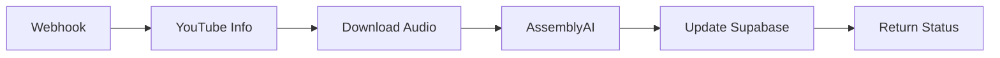

# 🎬 N8N Workflow para Transcripciones de YouTube

## 📊 Arquitectura del Workflow



## 🔧 Nodos Necesarios

### 1️⃣ **Webhook Node** (Trigger)
```json
{
  "httpMethod": "POST",
  "path": "youtube-transcript",
  "responseMode": "onReceived",
  "responseData": "allEntries"
}
```

**Recibirá:**
```json
{
  "youtube_url": "https://youtube.com/watch?v=xxx",
  "memory_id": "uuid-here",
  "supabase_url": "https://xxx.supabase.co",
  "supabase_key": "service-role-key"
}
```

### 2️⃣ **HTTP Request Node** (Get Video Info)
```
Method: GET
URL: https://www.youtube.com/oembed?url={{$json.youtube_url}}&format=json
```

**Obtiene:**
- Título del video
- Canal
- Thumbnail

### 3️⃣ **Code Node** (Extract Video ID)
```javascript
// Extraer video ID de la URL
const url = $input.first().json.youtube_url;
const videoId = url.match(/(?:youtube\.com\/watch\?v=|youtu\.be\/)([^&\n?#]+)/)?.[1];

return {
  video_id: videoId,
  youtube_url: url,
  memory_id: $input.first().json.memory_id
};
```

### 4️⃣ **Execute Command Node** (Download Audio)
```bash
# Comando para descargar audio
yt-dlp -x --audio-format mp3 -o "/tmp/{{$json.video_id}}.mp3" "{{$json.youtube_url}}"
```

**⚠️ PROBLEMA**: N8N Cloud no tiene yt-dlp instalado

### 5️⃣ **Alternativa: Servicio Externo**
Como N8N Cloud no puede ejecutar yt-dlp, necesitamos un servicio intermedio:

#### **Opción A: Usar cobalt.tools API**
```javascript
// Code node para obtener audio URL
const response = await fetch('https://api.cobalt.tools/api/json', {
  method: 'POST',
  headers: {
    'Accept': 'application/json',
    'Content-Type': 'application/json'
  },
  body: JSON.stringify({
    url: $input.first().json.youtube_url,
    downloadMode: "audio"
  })
});

const data = await response.json();
return {
  audio_url: data.url,
  ...($input.first().json)
};
```

#### **Opción B: Tu propio servidor**
Crear un pequeño servidor que:
1. Reciba YouTube URL
2. Use yt-dlp localmente
3. Retorne URL del audio

### 6️⃣ **HTTP Request Node** (AssemblyAI)
```
Method: POST
URL: https://api.assemblyai.com/v2/upload
Headers:
  authorization: {{$json.assemblyai_key}}
Body: Binary (el archivo de audio)
```

Luego otro request para iniciar transcripción:
```
Method: POST  
URL: https://api.assemblyai.com/v2/transcript
Headers:
  authorization: {{$json.assemblyai_key}}
Body:
{
  "audio_url": "{{$json.upload_url}}",
  "language_detection": true,
  "punctuate": true,
  "format_text": true
}
```

### 7️⃣ **Wait Node**
Esperar que AssemblyAI complete (polling cada 5 segundos)

### 8️⃣ **Supabase Node** (Update)
```sql
UPDATE memories 
SET metadata = jsonb_set(
  metadata, 
  '{youtube,transcript}', 
  '"{{$json.transcript_text}}"'::jsonb
)
WHERE id = '{{$json.memory_id}}'
```

## 🚀 Versión Simplificada (Sin Audio Download)

Si el download de audio es muy complejo, podemos usar **YouTube Transcript API**:

### **Python Code Node** (Requiere self-hosted)
```python
from youtube_transcript_api import YouTubeTranscriptApi

video_id = _input['video_id']
try:
    transcript = YouTubeTranscriptApi.get_transcript(video_id)
    full_text = ' '.join([t['text'] for t in transcript])
    return {'transcript': full_text, 'success': True}
except:
    return {'transcript': None, 'success': False}
```

## 🎯 Implementación en FoundIt.at

### **Frontend: Llamar a N8N**
```typescript
// src/utils/n8nTranscript.ts
export async function requestN8NTranscript(
  youtubeUrl: string, 
  memoryId: string
) {
  try {
    const response = await fetch(
      'https://tu-workspace.app.n8n.cloud/webhook/youtube-transcript',
      {
        method: 'POST',
        headers: { 'Content-Type': 'application/json' },
        body: JSON.stringify({
          youtube_url: youtubeUrl,
          memory_id: memoryId,
          supabase_url: process.env.NEXT_PUBLIC_SUPABASE_URL,
          supabase_key: process.env.SUPABASE_SERVICE_ROLE_KEY,
          assemblyai_key: process.env.ASSEMBLYAI_API_KEY
        })
      }
    );
    
    return await response.json();
  } catch (error) {
    console.error('N8N transcript request failed:', error);
    return { success: false, error };
  }
}
```

### **Backend: Modificar Process Video**
```typescript
// En src/app/api/process-video/route.ts
// Agregar después de intentar YouTube API

if (!transcriptData) {
  // Intentar con N8N
  console.log('Attempting N8N transcript...');
  const n8nResult = await requestN8NTranscript(url, memoryId);
  
  if (n8nResult.success) {
    transcriptData = {
      transcript: n8nResult.transcript,
      transcriptLanguage: n8nResult.language || 'en',
      transcriptSource: 'n8n-assemblyai'
    };
  }
}
```

## 🔒 Consideraciones de Seguridad

1. **API Keys**: Nunca expongas keys en el frontend
2. **Validación**: Valida que el memory_id pertenece al usuario
3. **Rate Limiting**: Limita requests por usuario
4. **Webhook Security**: Usa un token secreto en el webhook

## 💰 Costos Estimados

- **N8N Cloud**: Gratis hasta 20 workflows activos
- **AssemblyAI**: $0.90/hora de audio
- **Servidor (si self-host)**: $5-10/mes
- **Storage temporal**: Mínimo

## 🚧 Limitaciones y Alternativas

### **Problema Principal: yt-dlp en Cloud**
N8N Cloud no permite instalar binarios como yt-dlp.

### **Soluciones:**
1. **N8N Self-hosted** en VPS con yt-dlp instalado
2. **Microservicio** separado para download
3. **YouTube Transcript API** (cuando está disponible)
4. **Servicios terceros** como cobalt.tools

## 📝 Próximos Pasos

1. **Crear cuenta N8N Cloud** para probar
2. **Diseñar workflow** básico sin audio
3. **Evaluar** si necesitas self-hosting
4. **Implementar** versión simple primero
5. **Escalar** según necesidades

---

💡 **Recomendación**: Empieza con N8N Cloud + YouTube Transcript API. Si funciona bien, evalúa si vale la pena self-hosting para usar yt-dlp.